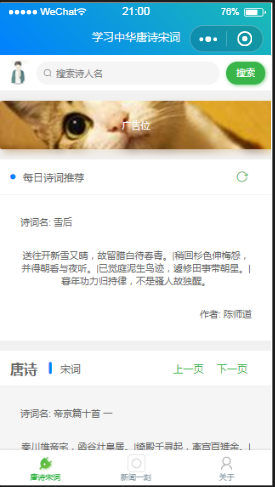
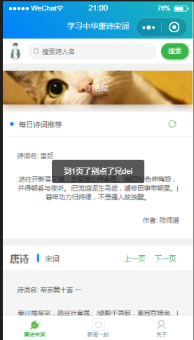
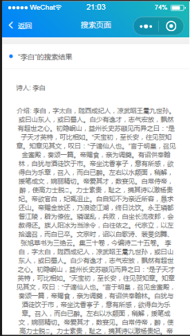
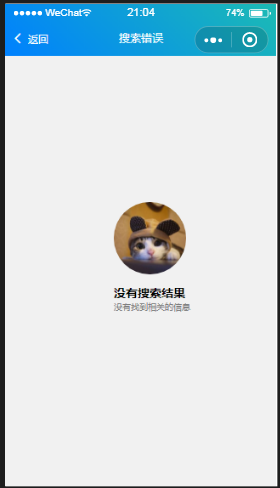
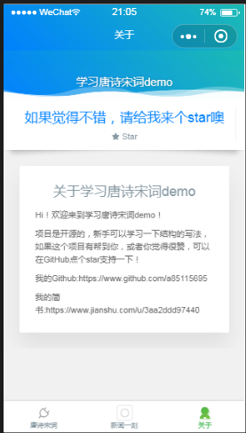

# WeAppProject
这是一个持续更新的微信小程序demo，使用了大佬的免费接口才得以获得数据，这也是本人闲暇之余做的一个小东西，也就是几天时间吧，大概每天就几个小时？反正可以借鉴给新手学习一下，自己也是做着玩一下，预计更新三版，完善后就准备做其他项目。
# MD
后续还会做一些微信小程序的demo，例如电影类，商城类的demo，不是什么大佬，就是菜鸡一枚，最近项目遇到了微信小程序，自己也特别感兴趣，就放进了仓库，目前这是第一阶段的自定义组件，后续还会更新。
觉得不错的话，
大家可以看看我的简书：https://www.jianshu.com/u/3aa2ddd97440
里面还有一些转行前端的心得噢，新手快来一起成长鸭~
# 预览图
- 
- 
- 
# 更新说明
v0.1
1.唐诗宋词栏目添加分页加载。OK //目前先用上一页下一页替代，之后研究1，2，3，4这样的分页
2.每日推荐诗词添加刷新按钮，点击刷新推荐诗词。OK
3.搜索框接入搜索接口。OK
4.搜索页面实现分页加载，一页显示十条数据。 OK //先改为只能搜索诗人
5.新闻一刻添加视频组件模板，添加推荐新闻接口。OK
6.关于界面更改样式，区别于colorUI。OK
7.唐诗宋词栏目添加底纹，实现方法用一个数字区分栏目，基数加底纹。OK
8.弄好获取微信用户信息。OK
接口地址:
https://www.jianshu.com/p/e6f072839282
分页加载:
https://blog.csdn.net/xiehuimx/article/details/74938034

v0.2 空闲时间更新
1.新闻界面添加刷新按钮，随机插入各种新闻（娱乐，科技等等)。
2.关于界面做一个插件卡片，添加一些有趣的小工具。
3.增加一些动态效果。
4.添加provide文件夹，把接口全部写入一个文件。
4.想起来再说。
